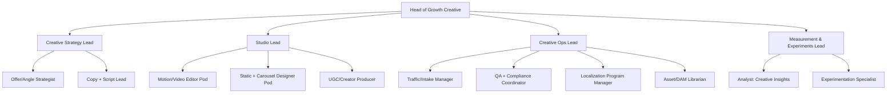

# Designing an AI Agent That Excels at Ad Creative Production Across Static, Short-Form, Long-Form, and Creative Ops

## Executive summary

An AI agent that consistently produces winning ad creative is less a “prompt” and more an operating system: a **human-in-the-loop creative factory** that (a) translates strategy into platform-native assets, (b) enforces brand/legal/platform constraints automatically, (c) produces **high-volume, testable variations**, and (d) learns from in-market outcomes via structured measurement and postmortems. The strongest evidence base converges on four truths.

First, **creative quality is a dominant driver of performance**, often outweighing media tactics when the creative is strong. Nielsen’s analysis of five key drivers (creative, reach, targeting, recency, context) reports that creative quality can contribute as much to in-market success as all other factors combined; when creative is strong it can be the overwhelming driver (reported up to 89% for digital). citeturn24view0turn24view1

Second, “creative” is not just being original; it is **original + appropriate** (“fits the brand, message, and audience”) and tends to work primarily by improving attitudes and perceptions—not merely by being memorable. A large meta-analysis synthesizing 67 papers (93 datasets, 878 effect sizes) finds robust positive effects of advertising creativity, with stronger effects for ad responses than brand responses, and stronger effects on attitudinal outcomes than memory; it also warns that measuring creativity as originality alone understates the effect. citeturn24view3

Third, for short-form and performance placements, winning ads usually succeed because they are **platform-native, fast to comprehension, and systematically iterated**. TikTok’s guidance emphasizes that users prefer content that doesn’t feel overly polished and that brands should build TikTok-first creative using trends, structure, and sound. citeturn14view0turn14view3turn15search6 Google’s YouTube creative framework (ABCDs: Attention, Branding, Connection, Direction) encodes similar principles for attention capture, early brand presence, emotional connection, and clear next steps. citeturn15search0turn15search12

Fourth, measurement and iteration must evolve beyond clicks. In the current ecosystem, a credible creative system pairs (1) platform metrics (VTR/view rate, CTR, CVR, ROAS), (2) **viewability standards** (commonly 50% pixels in view for 2 seconds for video), and (3) emerging **attention frameworks** with clear disclosure/auditing expectations. citeturn9view2turn25view2turn25view0turn25view1turn8view2

The rest of this report builds an evidence-backed blueprint: profiles and case studies from leading production models; why ads fail and how to diagnose it; comparative tradeoffs, budget/time benchmarks; reproducible playbooks (prompt templates, specs, QA, testing matrices); a recommended tooling stack; org structures; and a measurement + creative ops KPI system.

## Evidence-backed why ads succeed or fail

Strong creative performance is repeatedly associated with (a) clear early branding and readability, (b) entertainment or emotional resonance matched to platform norms, (c) rapid comprehension and “hook” mechanics, (d) coherent messaging with a single job-to-be-done, and (e) disciplined iteration to combat fatigue and improve fit.

### What “creative quality” means in research terms

Academic synthesis matters because it keeps teams from optimizing for the wrong proxy. The large meta-analysis of advertising creativity emphasizes that creativity works best when it is treated as **bipartite**: originality plus appropriateness; and that its measurable benefits are more reliably found in **attitude and perception** shifts than in memory lift alone. This is highly actionable for AI agents: the model must be trained/evaluated not merely on “novelty,” but on **brand fit, audience fit, and clarity**. citeturn24view3

### Creative is a primary lever, not a finishing touch

Nielsen’s findings argue that when creative is strong, it becomes the overwhelming driver of success (reported up to 89% for digital); when creative is weak, uplift is weak and media factors dominate. citeturn24view0turn24view1 This supports an operational design principle: your AI agent should allocate disproportionate effort to **creative development, quality control, and iteration velocity**, rather than spending most “intelligence” on targeting tweaks.

### Short-form success: entertaining, branded, and structured

A major short-form effectiveness program described by System1 reports testing **887 short-form video ads** with **92,000+ TikTok users**, matched to **350+ brand and conversion lift studies**, to link creative quality to outcomes. citeturn16search0turn16search4 WARC’s reporting on the System1/TikTok work highlights creativity and entertaining features as drivers of brand impact in short-form formats. citeturn16search15

Platform guidance aligns tightly with that research:
- TikTok: “TikTok-first,” trends as storytelling templates, structure (hook/body/close), stimulation via editing and overlays, and sound strategy. citeturn15search6turn14view1turn14view3  
- YouTube: ABCDs emphasize fast attention, early branding, emotional connection, and explicit direction/CTA, backed by Google’s creative effectiveness research program. citeturn15search0turn15search12turn8view3  

### Why ads fail: three common, diagnosable classes

Most failures cluster into three root-cause classes. These are the categories an AI agent should explicitly score and log.

**Creative concept failure (strategic mismatch).** The message does not map to the audience’s beliefs, the moment, or the platform norm. A canonical example is Pepsi’s Kendall Jenner “protest” ad: credible analyses describe it as dishonest/contrived and criticized it for trivializing serious social justice imagery; backlash led Pepsi to pull the ad and apologize. citeturn16search6turn16news39turn16news42

**Execution failure (craft mismatch).** The idea is sound, but the first frame, pacing, sound mix, legibility, or demonstration is wrong for the placement. Short-form platforms explicitly warn against static, low-quality, or unclear audio. TikTok’s ad format/functionality policy, for example, requires legibility/high resolution, minimum/maximum length rules, includes audio-quality requirements, and discourages static video where still images occupy most of the time. citeturn9view4

**Iteration failure (learning mismatch).** The ad might have worked with variation/testing, but the team shipped too few variants, refreshed too slowly, or measured the wrong KPI. Even “brand lift” proxies can mislead: WARC summarizes research suggesting ad recall can be inaccurate at high rates due to false positives/negatives, which can distort planning if treated as ground truth. citeturn22search3

## Top performers and what their operating models reveal

Even across very different providers—subscription creative services, marketplaces, production studios, and analytics platforms—the same operational pattern emerges: **standardize inputs → modularize outputs → enforce QC → iterate with measurement**.

### Comparative table of production models and tradeoffs

| Production model | Best for | Strengths | Weaknesses / risk | Evidence-backed benchmarks |
|---|---|---|---|---|
| In-house (centralized) | High brand control, long-lived pipelines | Deep brand knowledge; tighter governance | Capacity bottlenecks; slower scaling across formats/locales | Many marketers are increasing in-house creative ops for control and efficiency (macro trend). citeturn4search24 |
| Full-service agency | “Hero” brand films, integrated campaigns | High craft + strategy | Often slower + higher cost for iterative performance volume | Benchmark comparisons used by some modern providers position traditional agencies as slower/costlier (see subscription benchmarks below). citeturn18view1 |
| Hybrid subscription / “Creative as a Service” | Always-on performance creative + steady volume | Predictable capacity, standardized workflows, faster iteration | Risk of “factory output” if creative strategy is weak; needs strong governance artifacts | Example: Shuttlerock positions itself as 2× faster and 67% less expensive than traditional agencies (via TrinityP3 benchmark), and states typical production of new video ads in 3–5 business days. citeturn18view1 |
| Marketplace + vetted maker network | Fast access to specialized production styles and locales | Good for bursts; access to diverse production teams | Requires strong briefing + QA; creative consistency risk without templates | QuickFrame describes a hand-vetted maker community and network approach to production. citeturn22search2 |
| Boutique animation/explainer studio | Long-form explainers, complex narratives, regulated storytelling | High narrative control; strong craft in scripting/storyboarding | Longer timelines; higher cost; less suited to high-velocity variant testing | Yum Yum Videos describes standard 6–10 week timelines for high-quality custom explainers (with rush premiums) and provides pricing bands by style/complexity. citeturn21view1turn21view2 |
| Creative analytics + preflight QA platforms | Standardizing quality across volume & markets | Forces consistency, best-practice compliance, scalable measurement | “Score chasing” risk; must validate against outcomes | CreativeX’s Creative Quality Score concept aims to measure adherence to best practices; preflight QA can validate platform/brand rules before spend. citeturn24view4turn22search18 |

### Case studies and operational details from requested leaders

The goal here is not to “name drop,” but to extract **repeatable methods** and **benchmarks**.

**Superside (enterprise production scaling + AI-enhanced design system).**  
A documented enterprise case describes Amazon Home working with Superside to offload production and resizing/retouching and deliver high volumes: over a three-month window the case reports **1,092 assets over 20 projects** and at least **345 hours saved**, enabling internal staff to refocus on art direction and reduce burnout. citeturn3view0 A separate Superside report on its first 200 AI-enhanced design projects claims AI reduced design hours 30–60% across projects and estimated thousands of hours saved, framing the method as a hybrid of brand data, prompt engineering, and model tuning. citeturn3view1 Forrester TEI research on Superside’s model describes subscription fees, workflow flexibility, and customer-reported avoidance of hiring additional designers, including references to AI-accelerated workflows. citeturn8view0

**Shuttlerock (subscription creative, platform, and preflight QA integration).**  
A client success story reports Oliver’s Travels producing **15 new videos per month**, with **50+ videos in three months** and **68% lower cost-per-asset** compared to an industry benchmark; the narrative emphasizes repurposing existing assets into platform-ready video creative and scaling during peak seasons with fixed-cost pricing. citeturn5view0turn18view1 Shuttlerock’s own solution overview states that its in-house team delivers new video ads in **3–5 business days**, and claims benchmarking of **2× faster turnaround** and **67% less expensive** than traditional ad agencies via TrinityP3. citeturn18view1 Shuttlerock also documents integrating CreativeX for preflight scoring and compliance checks prior to launch. citeturn22search0turn22search4turn22search18

**QuickFrame (marketplace + production ops + multi-variant delivery).**  
A QuickFrame case study for Self reports a **3-week** production window to produce OTT commercials, generating two creative concepts with cutdowns for A/B testing; the reported outcome includes a **28% decrease in cost per app install** versus Self’s average and **8 total videos**. citeturn19view0 Another QuickFrame case for Ben Bridge reports **85 deliverables across 3 campaigns**, edited for multiple platforms and aspect ratios, an **average 75% video completion rate**, and an **average 5-day turnaround from shoot day to rough cut**—explicitly tying success to cutdowns, platform-specific versions, and efficient production management. citeturn20view0 QuickFrame describes its “maker community” model as a global network of vetted production companies designed for faster, more cost-effective delivery than traditional production. citeturn22search2turn22search6

**Colormatics (performance outcomes + research-led creative execution).**  
A Squatty Potty campaign case study describes initiating with market research and surveys to refine target audience and messaging, then producing an unconventional campaign; reported performance includes **200+ million impressions**, **1+ million clicks**, and **4 ROAS**, plus awards recognition. citeturn5view1 A Fiverr case study describes producing and deploying multiple direct-response TV spots with performance gauging and reports **150+ million impressions** nationally, emphasizing iterative deployment and real-time feedback loops. citeturn7view0

**Yum Yum Videos (long-form production economics + risk controls).**  
Their explainer pricing guide provides explicit production economics: a professional custom video typically takes **6–10 weeks**, with “rush” projects often carrying **20–50% premiums**; it also provides style-based price ranges per 60 seconds (e.g., custom 2D animation and higher-end 3D/live-action tiers). citeturn21view1turn21view2turn21view0 Regardless of vendor specifics, the transferable method is the same: script and storyboard discipline, specialist roles, and revision planning act as quality control that prevents expensive late-stage corrections. citeturn21view2

### Adjacent leaders to borrow from

**Wieden+Kennedy, R/GA, Droga5 (creative excellence organizations).**  
These agencies are useful references for concept and craft, but operational benchmarking for always-on performance creative is often less transparent than the providers above. Wieden+Kennedy’s Nike “Dream Crazy” work is documented in their portfolio as part of long-running “Just Do It” storytelling; the repeatable lesson is the disciplined use of narrative and cultural positioning while remaining unmistakably branded. citeturn4search1 For always-on ad systems, you typically borrow the **creative principles** from these agencies but rely on the **production systems** and **measurement loops** from performance-focused providers.

## AI agent blueprint for creative production at scale

The most effective “AI agent” in ad creative is a set of specialized sub-agents plus governance. The system should behave like a **creative operating line** with explicit artifacts, gating, and a learning memory.

### System architecture for an AI creative agent

This architecture aligns with how high-scale providers operationalize work: structured briefing, consistent production, and iteration with testing and measurement. citeturn18view1turn19view0turn3view0

### Reproducible playbooks and checklists

Below are playbooks designed to be **directly reusable** as agent instructions (or SOPs for humans + AI).

#### Brief ingestion checklist (agent “Intake”)

The Intake module should refuse to proceed until these are present (or explicitly marked “unknown” plus assumptions logged):

- Objective and optimization event (awareness / consideration / conversion; purchase, lead, install, etc.).  
- Primary audience definition + exclusions (and what stage of awareness they’re in).  
- Offer + proof + constraints (price, guarantees, shipping, eligibility, disclaimers).  
- Brand rules: logo usage, voice/tone, banned claims, required legal copy, category restrictions.  
- Deliverables: formats (static/carousel/story/reel/6s/15s/30s/60s), aspect ratios, cutdowns, language/locales.  
- Measurement plan: primary KPI, guardrail KPIs, and decision threshold.  
- Production model: in-house vs subscription vs marketplace vs full-service + deadline.

This reflects why scalable systems emphasize standardized briefing: Shuttlerock describes “easy online briefing,” and Superside’s Amazon case emphasizes managed intake via a dedicated PM who clarifies questions before production. citeturn18view1turn3view0

#### “Concept matrix” template (agent “Strategist”)

Use a 3×3 matrix: **Angle × Proof × Format Hook**.

- Angles: (1) pain relief, (2) aspiration/identity, (3) curiosity/novelty  
- Proof: (1) demo, (2) testimonial/UGC, (3) authority/data  
- Hook pattern: (1) pattern interrupt, (2) problem-first, (3) outcome-first

The agent generates 9 concepts, then scores each on:
- **Appropriateness** (brand fit, audience fit)  
- **Clarity** (single message)  
- **Platform nativeness** (e.g., TikTok-first) citeturn15search6turn24view3

#### Prompt templates (copy/pacing/storyboard)

**Hook generator (short-form 6–15s):**  
“Generate 20 hook options for a 9:16 short-form ad. Audience: __. Offer: __. Format: UGC/testimonial. Constraints: must show product in first __ seconds; must be understandable with sound off; CTA: __. Produce hooks in 6 categories: shock, question, myth-bust, POV confession, demo start, social proof.”

**ABCDs script builder (YouTube skippable/non-skippable):**  
“Write 3 scripts (15s, 30s, 60s) using ABCDs: Attention in first 5 seconds; Branding early and repeated; Connection via __ emotion and __ story; Direction with single CTA. Provide on-screen text plan + VO plan.” citeturn15search0turn15search12turn9view5

**TikTok structure builder:**  
“Create 5 TikTok-first scripts using hook/body/close. Use trends as storytelling templates only if brand-safe. Add sound strategy: voiceover + music cue + captions. Ensure 9:16 framing and leave UI-safe space.” citeturn15search6turn14view1turn9view4

#### QA gate checklist (brand safety + platform + production)

A scalable system requires a **preflight gate** before spend.

Core checks:
- Platform compliance: duration, resolution, aspect ratio; dynamic content rules; audio clarity. (Example: TikTok policies require dynamic content and audio quality; discourage overly static video.) citeturn9view4turn8view5turn9view3  
- Claim substantiation: any quantified claim has documented evidence; required disclaimers present.  
- Rights: music and creator agreements; for TikTok, use business-cleared options such as the Commercial Music Library strategy described in TikTok’s playbooks. citeturn14view1  
- Disclosures: influencer/endorsement relationships clearly disclosed following FTC guidance. citeturn15search3turn15search11turn15search15  
- “Safe zones” / UI obstruction: keep critical text/logos/CTAs away from edges and overlay regions (use templates and preview tools). (Where direct Meta documentation access is constrained, teams typically use safe-zone templates and third-party guides operationalizing placement overlays.) citeturn10view1turn11search2  
- Versioning: naming conventions, locale tags, aspect ratio tags, and approval logs (prevents outdated or unapproved assets shipping). Practical asset governance failures are called out in QuickFrame’s discussion of mismanaged assets causing delays and legal/version risk. citeturn18view0  
- Optional: independent creative scoring / preflight automation (CreativeX-style preflight). citeturn22search18turn22search4

### Recommended tech stack (by function) with pros/cons

Because Google’s Ads Creative Studio was sunset in March 2025, the system should assume **partner tools + internal automation** for “mass customization,” rather than relying on a single Google-native studio product. citeturn13search1turn14view4

**Generative and planning layer**
- LLM for scripting, variations, localization drafts, and experiment design (pro: rapid ideation; con: must be constrained to avoid hallucinated claims).  
- Brand knowledge base (style guide embeddings + claim library + approved phrasing). Superside’s AI design system framing underscores that brand data is required to generate assets that meet non-mega-brand specs. citeturn3view1

**Creative production layer**
- Editing and templating pipeline (motion templates, modular scenes, variant generator). Large-scale creative guideline systems are often managed via standardized best practices and measured by adherence (CreativeX CQS logic). citeturn24view4turn22search18  
- Marketplace/subscription production partners when volume spikes (Shuttlerock-style 3–5 business day production windows; QuickFrame maker network for specialized shoots). citeturn18view1turn22search2turn20view0

**Asset management and version control**
- Central DAM/MAM + strict naming + approval metadata. QuickFrame’s asset-management warning (fragmented storage → recreations, delays, outdated legal-approved assets) demonstrates why this is non-negotiable for omnichannel creative. citeturn18view0

**QA and brand safety**
- Automated preflight checks (dimensions, bitrate, subtitles present, logo presence, prohibited words/visuals) + optional third-party scoring (CreativeX). citeturn22search18turn22search4

**Analytics and measurement**
- A unified dashboard combining platform metrics, standardized viewability, and attention where appropriate. Viewability standards (50% pixels / 2 seconds for video) provide a baseline. citeturn9view2turn25view2turn25view1

### Sample org chart and role descriptions

A high-performing creative ops team for AI-driven ad production usually splits into: **Strategy, Studio, Ops, and Measurement**.

Role responsibilities should map to the evidence:
- **Creative Insights + QA** becomes essential because creative quality drives outcomes and because scaling increases the risk of quality erosion. citeturn24view0turn24view4  
- **Experimentation** must be explicit to counter creative fatigue and quickly find platform fit. citeturn16search16turn24view5  
- **Legal/compliance** must be embedded because influencer and endorsement disclosure obligations are actively enforced and updated (FTC revised guides in 2023). citeturn15search11turn15search15  

## Formats, deliverability, localization, and platform specifications

A creative agent must treat “format” as strategy, not cropping. This section provides practical specifications and operational guidance for the formats you listed.

### Core format families and what the agent must optimize

**Static (single image) and carousel**
- Optimize for instantaneous comprehension: single focal point, single claim, legible typography and contrast for mobile-first consumption (consistent with YouTube and TikTok mobile-first guidance themes). citeturn8view3turn15search6  
- Production scalability comes from templates + modularity; erosion risk is real at volume, motivating guideline systems like Creative Quality Score. citeturn24view4

**Stories/Reels/vertical placements**
- “Safe zone” discipline is a deliverability requirement: the agent should automatically place key elements within a central-safe region and generate preview crops for each placement. Operationally, many teams use safe-zone templates and preview tooling to reduce rework. citeturn10view1turn11search2

**Short-form 6–15s**
- YouTube: bumper ads are up to 6 seconds; standard non-skippable are 7–15 seconds, with other duration mixes possible in non-skippable formats. citeturn9view5turn4search22  
- TikTok: official specs commonly support 5–60 seconds with recommended durations depending on placement; some placements recommend ~21–30 seconds (Global App Bundle spec). citeturn8view5turn9view3  
- Short-form craft principle: a large portion of impact is often realized extremely early; MNTN’s synthesis cites studies where 47% of the value of a video campaign is delivered in the first three seconds. citeturn14view7

**Long-form (30–60–90s, explainers, CTV)**
- The winning system is modular cutdowns plus a core narrative. QuickFrame’s Ben Bridge and Self case studies explicitly describe generating multiple cutdowns/variants to identify what drives performance, and report strong completion/CPI outcomes. citeturn20view0turn19view0  
- High-craft explainers follow longer timelines; Yum Yum Videos reports 6–10 week cycles for custom explainers (with rush premiums), implying long-form should be scheduled as a separate pipeline with tighter stakeholder management. citeturn21view1turn21view0

### Localization and personalization at scale

A scalable agent localizes by modularizing content:
- Separate “immutable core” (brand assets, product truth, legal claims) from “mutable layers” (language, offer, cultural cues, seasonal hooks, creator casting).
- Personalization should be **controlled**: use a component library and assemble variations, rather than generating entirely new unreviewed ads.

Google’s Ads Creative Studio launch case studies demonstrate the performance logic of customization. In Google’s own write-up, GM South America used the tool to produce multiple unique ads and reported cost reductions and improved search outcomes, illustrating how standardized customization pipelines can reduce cost and improve performance. citeturn14view4 Even though Ads Creative Studio was sunset in March 2025, the underlying operational strategy—modular assets + scalable customization via partners—remains valid. citeturn13search1turn14view4

### Visual reference examples

image_group{"layout":"carousel","aspect_ratio":"16:9","query":["TikTok Creative Codes hook body close infographic","YouTube ABCDs of effective video ads Attention Branding Connection Direction graphic","Meta Reels Stories safe zone template 9:16 overlay","CTV ad storyboard example 15 second cutdown"] ,"num_per_query":1}

## Testing, measurement, dashboards, and creative ops KPIs

The agent’s competitive advantage comes from how it tests and learns. This requires (1) definitions and standards, (2) correct experimentation designs, and (3) an operational dashboard that ties creative decisions to outcomes.

### Measurement metrics the agent should compute and interpret

**View rate / VTR (video engagement proxy).** Google defines TrueView view rate as similar to CTR, but counting views after impressions; it provides a clear calculation framework. citeturn17search0

**View-through conversions.** Google defines view-through conversions as conversions that occur after an ad impression where the user didn’t interact, then later converts; Google’s help clarifies the “view-through conversions” column meaning. citeturn17search1turn17search9

**ROAS.** Google Ads community guidance defines ROAS as return on ad spend, measuring revenue per dollar spent. citeturn17search2

**Viewability.** Microsoft Advertising documents video viewability measurement based on IAB guidance: 50% of the surface in view for a minimum of 2 seconds, which is a widely used baseline standard across measurement conversations. citeturn9view2

**Attention metrics (emerging layer).**  
Nielsen’s Outcomes Marketplace launch describes integrating attention and emotive response metrics from Realeyes into Nielsen ONE, positioning attention as a complement to reach/frequency and as predictive of sales outcomes. citeturn8view2 The IAB and MRC Attention Measurement Guidelines exist specifically to standardize attention measurement terminology, methodologies, and disclosure requirements, and emphasize transparency/comparability; the accompanying playbook recommends hybrid methodologies and controlled testing before scaling. citeturn25view2turn25view0turn25view1

### A/B and multivariate testing methods

A robust testing system for creative follows three principles:

1) **Test the highest-leverage variables first** (hook/first frame, offer framing, proof form, CTA). This matches platform guidance emphasizing early attention and clear direction. citeturn15search0turn15search6turn14view7

2) **Use structured variation to fight fatigue.** Meta’s analytics team defines creative fatigue as the effect of users seeing the same creative repeatedly; research in online advertising also recognizes heterogeneous wear-out and motivates fatigue-aware creative selection. citeturn16search16turn24view5

3) **Separate “creative” from “targeting” tests.** If you change both, you can’t attribute learning.

#### Testing matrix (reproducible)

Start with a base creative; then create variants in a controlled factorial grid:

- Hook (3): problem-first / outcome-first / curiosity  
- Proof (2): demo / social proof  
- CTA (2): “Shop now” vs “Learn more” (or lead-gen equivalents)  
- Branding timing (2): brand in first 3 seconds vs later (especially for short form) citeturn15search12turn14view7

That yields 24 variants; in practice, you phase it:
- Phase 1: 6–8 variants emphasizing hook + proof.
- Phase 2: expand winners with CTA + branding timing.
- Phase 3: localize and personalize the winning structure.

### Sample dashboard and creative ops KPIs

A practical dashboard must be read two ways: **performance** (what’s working) and **operations** (how fast you can learn).

**Performance dashboard (per campaign × format × audience):**
- Spend, impressions, reach, frequency  
- View rate (or platform-defined VTR), 3-second view rate / early retention proxy (where available) citeturn17search0turn14view7  
- CTR, CVR, CPA/CPI, ROAS citeturn17search2  
- View-through conversions (where relevant) citeturn17search9  
- Viewability rate (baseline quality control) citeturn9view2  
- Optional: attention score / attentive seconds with methodology disclosure aligned to IAB/MRC guidance citeturn25view0turn25view1  

**Creative ops KPIs (the “factory health” layer):**
- Cycle time (brief → first draft; first draft → approval; approval → trafficked)  
- Throughput (assets/week by format)  
- Revision rate and root-cause tags (brief clarity, compliance, craft, stakeholder churn)  
- Test velocity (new variants/week)  
- Win rate of variants (share of variants beating control by threshold)  
- Localization SLA (time per locale)  
- QA defect rate (spec failures, copy errors, rights issues)

Providers’ case studies demonstrate tangible benchmarks that your dashboard should capture:
- Ben Bridge: 5-day average shoot-to-rough-cut turnaround, 75% completion rate, 85 assets delivered. citeturn20view0  
- Self: 3-week turnaround window, 28% CPI reduction, variants for A/B testing. citeturn19view0  
- Amazon Home: 1,092 assets delivered in 3 months, 345 hours saved. citeturn3view0  
- Oliver’s Travels: 15 videos/month, 68% lower cost-per-asset, 50+ videos in three months. citeturn5view0  

## Prioritized primary sources and research index

The citations embedded throughout the report are the “links,” but the sources below are prioritized because they are either primary research, platform standards, or detailed operational case studies.

**Creative effectiveness and why it matters**
- Nielsen on creative as a dominant driver (including the “strong creative → overwhelming driver” framing). citeturn24view0turn24view1  
- Meta-analysis of advertising creativity (originality + appropriateness; attitude vs memory effects). citeturn24view3  
- CreativeX CQS report on creative quality erosion and guideline-based systems. citeturn24view4  

**Platform guidance that should hard-code into the agent**
- TikTok Creative Codes and playbooks (structure, trends, sound, TikTok-first principles). citeturn15search6turn14view1turn14view3  
- TikTok ad specs + policy constraints (durations, formats, audio requirement, “don’t be static”). citeturn8view5turn9view4turn9view3  
- Google/YouTube ABCDs + ad duration definitions (bumper 6s; non-skippable ranges). citeturn15search0turn9view5turn4search22  
- Google definitions for view rate and view-through conversions (metric correctness). citeturn17search0turn17search9turn17search1  

**Attention and measurement standards**
- IAB framework + IAB/MRC Attention Measurement Guidelines (standardization, disclosure, auditing). citeturn25view2turn25view0  
- CIMM + IAB Attention Measurement Playbook (operationalization, hybrid methods, controlled tests). citeturn25view1  
- Nielsen Outcomes Marketplace + Realeyes attention metrics (industry measurement direction). citeturn8view2  
- Video viewability definition (50% pixels / 2s baseline) documented by Microsoft Advertising using IAB guidance. citeturn9view2  

**High-signal operational case studies (production + outcomes)**
- Amazon Home production scaling (assets delivered + hours saved). citeturn3view0  
- Oliver’s Travels scaling (videos/month + cost-per-asset benchmark). citeturn5view0  
- Ben Bridge performance creative system (multi-platform deliverables, 5-day turnaround, completion rate). citeturn20view0  
- Self OTT creative production (3-week window, CPI reduction, concept + cutdowns). citeturn19view0  
- Squatty Potty performance outcomes (impressions, clicks, ROAS). citeturn5view1  

**Governance and compliance**
- FTC endorsements and revised guides (disclosure expectations; 2023 revisions). citeturn15search3turn15search11turn15search15  

**Postmortems and failure analysis exemplars**
- Pepsi Kendall Jenner ad: why it failed and why it was pulled (tone-deafness, backlash, apology). citeturn16news39turn16news42turn16search6