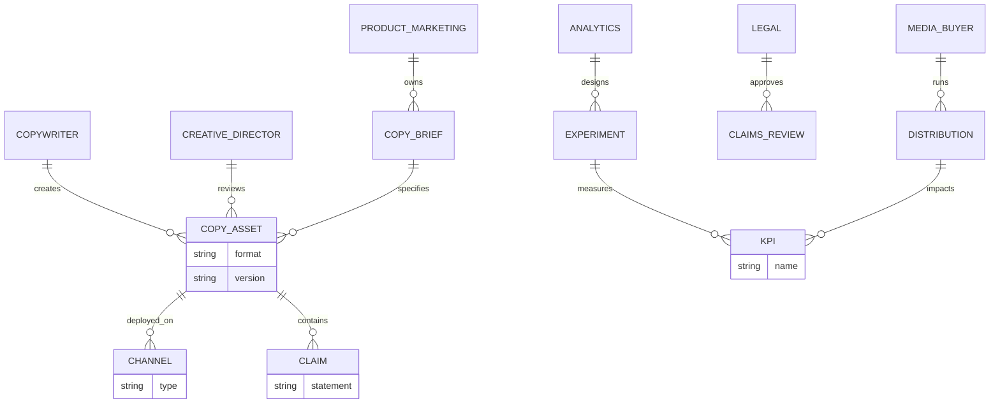

# Top Copywriters in History and What Their Work Shares

## Executive Summary

This report identifies ten widely influential copywriters—five “classic” (pre-digital, foundational to modern advertising practice) and five “modern” (direct-response and internet-era practitioners whose work is broadly used in contemporary marketing)—and synthesizes what their work consistently shares into a set of operational best practices, templates, and testing protocols. Selection is constrained to writers with strong primary-source footprints (books, published training materials, archived campaigns, documented tests) and/or high-authority institutional recognition (e.g., industry halls of fame), while explicitly flagging any claims that cannot be traced to a reputable primary or official source as **unspecified**. citeturn31search1turn19search5turn31search0turn35view0turn34view1

Across eras, the strongest common thread is not “clever writing,” but **disciplined persuasion engineering**: a single-minded focus on selling outcomes and reader action (rather than literary flourish), tight linkage to audience self-interest, clear and specific claims, structured argumentation (proof, mechanism, offer, risk control), and a persistent reliance on *testing* to settle disputes that opinions cannot. citeturn26view0turn26view3turn37search0turn37search1turn12view0

The classic cohort captures the conceptual bedrock: *advertising as measurable salesmanship* and the idea that disciplined experimentation can replace guesswork (Claude Hopkins); the “brand image” era combined with research-forward crafted messaging (David Ogilvy); systematic copy testing and direct-response pragmatism (John Caples); market maturity and “market creation” thinking (Eugene Schwartz); and relevance-centered creativity that rejects both dullness and showy irrelevance (entity["people","Bill Bernbach","ddb cofounder 1911-1982"]). citeturn26view1turn31search1turn51view0turn52view1turn38search6turn19search0

The modern cohort shows how the same fundamentals operationalize in today’s channels: list-first and market-first discipline in direct mail and newsletters (Gary Halbert); conversion copy built on controlled experiments and statistically grounded iteration (entity["people","Joanna Wiebe","copyhackers founder"]); scalable writing habits and reader-respect in content marketing (Ann Handley); practical formulas, “write like you talk,” and reusable checklists (Neville Medhora); and direct-mail mechanics + sequencing + curiosity in narrative selling (Dan Kennedy). citeturn14view2turn2view3turn12view0turn35view0turn33view0turn34view0turn34view1

Methodologically, the report translates these teachings into: (a) high-leverage rules (what to do and why), (b) reusable templates (headlines, email sequences, landing pages), (c) a test design playbook grounded in peer-reviewed experimentation guidance and government/academic copy-testing methods, and (d) a governance model that maps stakeholders to channels and assets, including compliance and research quality safeguards. citeturn37search0turn37search1turn37search2turn47view1

## Scope, Method, and Definitions

This report answers the question “Who are the top copywriters in history (classic and modern), what do they share, and what best practices follow?” under a constrained evidence rule: emphasize **primary and official** sources (original books and author-published materials; official publisher excerpts; official brand/agency archives; official filings), plus high-authority expert commentary where primary text is unavailable (major trade publications, institutional recognition pages, and peer‑reviewed research on testing/copy-testing). citeturn26view0turn28view0turn34view1turn35view0turn37search0turn47view1

Because “top copywriter” is inherently subjective, the selection criteria below are **assumptions** (explicitly stated because the prompt does not specify an objective ranking method). The intent is to choose writers whose methods are still operationally applicable and whose influence is supported by reputable evidence rather than internet folklore. **Where a popular claim (e.g., exact sales lift from a famous ad) cannot be verified in primary/official sources, it is labeled _unspecified_.** citeturn26view1turn37search0turn47view1

### Selection criteria and evidence basis

| Criterion (assumption) | What qualifies as evidence | Why it matters |
|---|---|---|
| Enduring impact on practice | Foundational books; institutional honors (e.g., hall of fame listings) | Helps separate durable methodology from temporary trends. citeturn31search1turn19search2turn31search0 |
| Reproducible method (not just “voice”) | Explicit frameworks, checklists, test protocols, or repeatable campaign patterns | Enables best practices you can operationalize. citeturn26view1turn33view0turn37search0 |
| Verifiable primary footprint | Author-published text, publisher excerpts, or official archives | Reduces reliance on unsourced “swipe file lore.” citeturn35view0turn34view1turn14view2turn28view0 |
| Demonstrated linkage to outcomes | Documented test results or official claims; otherwise mark **unspecified** | Protects rigor: persuasion claims should be tied to measurement. citeturn12view0turn37search0turn47view1 |

### Working definitions used in this report

**Copywriting** is treated as *persuasive writing intended to drive an action* (buy, subscribe, request, inquire, donate, retain), consistent with the “salesmanship-in-print” view embedded in classic doctrine. citeturn26view0

**Modern (internet-era) copywriting** is treated as copywriting that is either (a) distributed primarily through digital channels (landing pages, email, social ads) or (b) operationalized using modern measurement and rapid experiments (A/B tests, conversion optimization), even if the writer began pre-internet. citeturn12view0turn37search0

## Classic Copywriters and Core Teachings

The five classic copywriters below are included because their influence is supported by high-authority institutional recognition and/or durable primary texts and archived campaigns. For each, “signature works” are given with primary links (via citations), followed by core philosophies (with short verbatim quotes where available within fair-use limits), then “signature techniques” and a concrete copy excerpt/example. citeturn31search1turn26view0turn28view0turn51view0turn52view1turn19search0

### Comparative table of the classic five

| Copywriter | Selection evidence (primary/official) | Signature works (primary) | Core doctrines most reused today |
|---|---|---|---|
| entity["people","Claude C. Hopkins","advertising pioneer 1866-1932"] | Listed in entity["organization","American Advertising Federation","advertising trade org us"] Hall of Fame members list (1957) citeturn31search1turn19search2 and institutional profile citeturn19search5 | *Scientific Advertising* (original text PDF) citeturn26view0turn26view1turn26view2turn26view3 | Advertising as measurable salesmanship; specificity; coupon-based attribution; test campaigns as decision engine. citeturn26view1turn26view3 |
| entity["people","David Ogilvy","advertising executive 1911-1999"] | Hall of Fame listing (1977) citeturn31search1 and institutional profile citeturn31search0 | Archived campaigns on entity["company","Ogilvy","advertising agency"] site (75-year collection) citeturn28view0turn29view0turn30view0; bibliographic records for *Ogilvy on Advertising* (official listings) citeturn32search13turn32search4 | Research-forward copy; factual specificity; brand image discipline; headline and layout craft; “sell, don’t entertain.” citeturn18news46turn28view0 |
| entity["people","John Caples","direct response copywriter 1900-1990"] | Hall of Fame listing (1978) citeturn31search1 and Creative Hall profile citeturn51view0 | *Tested Advertising Methods* (primary access for full text is **unspecified**; institutional references only) citeturn51view0 | Testing culture; self-interest headlines; direct-response structure; “appeal” selection as decisive variable. citeturn51view0turn4search5 |
| entity["people","Eugene Schwartz","direct mail copywriter d 1995"] | Major trade tribute describing career and surviving copy citeturn53view0 | *Breakthrough Advertising* (publisher/official site with author’s 1984 introduction) citeturn52view1turn20search0 | Market creation/growth lens; channeling existing desire; structured steps to open new markets; headline intensity in direct mail. citeturn52view1turn53view0 |
| entity["people","Bill Bernbach","ddb cofounder 1911-1982"] | Hall of Fame listing (1977) citeturn31search1; ADC Hall of Fame profile citeturn19search0 | Quotes and doctrinal framing in major publisher excerpt citeturn38search6; campaign recognition evidence via entity["organization","U.S. Securities and Exchange Commission","us financial regulator"] filing referencing “We try harder” as top-ten campaign citeturn47view1 | Creativity that stays relevant to the selling idea; respect for audience intelligence; anti-formula rigidity; truth/honesty as persuasion. citeturn38search6turn43search13turn47view1 |

### Claude Hopkins

Hopkins is foundational because he articulated advertising as something that can be reasoned about and improved with measurement rather than taste. His core framing is explicit: **“Advertising is salesmanship.”** citeturn26view0 That sentence (and the paragraphs around it) sets the “north star” metric that reappears in direct response, CRO, and modern experimentation culture: whatever does not increase sales (or qualified demand with a measured path to sales) is waste. citeturn26view0turn26view1

His signature techniques remain operationally modern:

- **Test campaigns as the decision engine.** Hopkins argues disputed marketing questions can be settled by small tests and even gives concrete cost examples—for instance, describing tests that “may cost $3,000 to $5,000” and smaller tests of “about $1,000 each” (as reported in his era’s dollars). Modern equivalents are **unspecified** in this report. citeturn26view1  
- **Couponing and sampling for attribution and distribution.** He describes coupons redeemable “at any store” to create both sales and channel leverage, and cites products that achieved distribution that way (e.g., Palmolive Soap and Puffed Grains), which functions as an early attribution + channel-incentive pattern. citeturn26view2  
- **Specificity beats generality.** His argument is that precise claims carry weight because they imply testing and truthfulness; he contrasts vague statements with quantified ones (e.g., “reduced 25 percent”). citeturn26view3

A concrete copy excerpt pattern Hopkins presents is the use of **quantified, test-implying claims** (e.g., “reduced 25 percent” rather than “reduced”), which is less a single famous line and more a reusable tactic for modern landing pages and ads. citeturn26view3

### David Ogilvy

Ogilvy’s enduring value is the combination of brand-building discipline with research-led persuasion craft, preserved in institutional recognition and in an extensive archive of campaigns. citeturn31search1turn31search0turn28view0

A representative Ogilvy copy excerpt—preserved in an official agency archive—is the Rolls‑Royce headline:

> “At 60 miles an hour the loudest noise in this new Rolls‑Royce comes from the electric clock” citeturn29view0

This line exemplifies several “Ogilvy-like” mechanics visible in the ad itself: a precise, sensory, high-status benefit expressed as an objective observation, anchored in specificity rather than hype. citeturn29view0turn18news46

Ogilvy’s work also illustrates “story appeal” and visual curiosity hooks, visible in “The man in the Hathaway shirt” (eyepatch campaign), again preserved in the agency’s campaign archive. citeturn30view0turn28view0

On outcomes: an official Ogilvy reflection on this era’s work reports that the Rolls‑Royce campaign had to be paused because the company “couldn’t keep up with the demand” (a qualitative outcome; specific magnitudes are **unspecified**). citeturn27search3

A frequently cited Ogilvy maxim that captures his reader-respect stance is quoted in a major publication: **“The consumer is not a moron, she is your wife.”** citeturn18news46

### John Caples

Caples is anchored in direct response and copy testing culture, supported by major institutional profiles that explicitly call him a pioneer of testing and attribute to him some of the most reproduced direct-response headlines in history. citeturn51view0turn31search1

A signature copy excerpt is directly quoted in an institutional profile, capturing his “curiosity + social proof + narrative tension” headline style:

> “They laughed when I sat down at the piano… but when I started to play!” citeturn51view0

Caples’ “signature technique” is less about one headline and more about **systematic variation and measurement**: he is consistently framed as “pioneering copy testing” in institutional descriptions. citeturn51view0turn31search1

Because primary full-text access for *Tested Advertising Methods* is **unspecified** in the sources used here, detailed verbatim doctrinal quotes from the book itself are not included; however, reputable academic and institutional sources explicitly locate Caples’ contribution in the normalization of testing as the route to better advertising. citeturn4search5turn51view0

### Eugene Schwartz

Schwartz is most valuable for how he reframes “copy skill” as market skill, and for how he links persuasion to the lifecycle of markets. The most source-secure primary material available in this research set is an author-attributed 1984 introduction on the official publisher site for *Breakthrough Advertising*, where Schwartz states he discovered the book was really about a broader process of market development. citeturn52view1

A short verbatim distillation from that letter:

> “There is a way to develop an entirely new market… clearly-defined steps.” citeturn52view1

A major trade tribute provides additional biographical and technique context, including examples of the aggressive, high-intensity headlines typical of Schwartz’s era of direct mail, and it explicitly ties his career to mail-order agencies and his own firm. citeturn53view0

The tribute also captures a philosophy statement attributed to Schwartz:

> “The copywriter is the person who looks at things that other people don’t see.” citeturn53view0

Where modern marketers cite Schwartz for formalized “market awareness” stages, the exact framework text is **unspecified** in the accessible primary sources used here (the official site references it, but full chapter text is not reproduced in the accessible excerpt). citeturn52view1

### Bill Bernbach

Bernbach’s relevance is twofold: (1) he is institutionally recognized as a transformative figure in advertising creativity and team structure, and (2) his doctrine is regularly cited as the antidote to both “boring” copy and cleverness that doesn’t sell. citeturn19search0turn31search1turn38search6turn43search13

A concise Bernbach doctrine statement appears in a major publisher excerpt that discusses his quote directly:

> “Dullness won’t sell your product, but neither will irrelevant brilliance.” citeturn38search6

For case evidence: an official SEC filing for entity["company","Avis Budget Group","car rental company"] recounts that in 1963 Avis introduced the award-winning “We try harder” campaign and states it was considered one of the top ten advertising campaigns of the twentieth century by Advertising Age magazine (as reported by the company in its filing). citeturn47view1

For comparative historical recognition: entity["organization","The Guardian","uk newspaper"] reports that in the same 1999 issue of Advertising Age that ranked Bernbach as the most influential advertising person of the 20th century, a 1959 DDB campaign (“Think Small”) was rated first among the century’s top 100 campaigns. citeturn43search13

## Modern Copywriters and Digital Direct-Response Teachings

The five modern writers below were chosen because each has accessible primary/official material (author-published letters or courses; official publisher pages; documented conversion tests; or durable institutional distribution). This section also draws on peer‑reviewed experimentation research and government/academic standards for copy testing, because modern copywriting is inseparable from measurement and research quality. citeturn14view2turn12view0turn35view0turn33view0turn34view1turn37search0turn37search1turn37search2

### Comparative table of the modern five

| Copywriter | Primary materials used here | Core contribution to modern practice | Outcome evidence in sources |
|---|---|---|---|
| entity["people","Gary Halbert","direct response copywriter 1939-2007"] | *The Boron Letters* chapters hosted on author site citeturn14view1turn14view2; author site context citeturn11view0 | Market-first thinking; list/audience as leverage; direct-mail discipline portable to email/landing pages. citeturn14view2 | Specific campaign metrics **unspecified** in accessed primary sources; selection based on durable primary corpus and broad industry citation. citeturn11view0turn14view2 |
| entity["people","Joanna Wiebe","copyhackers founder"] | Documented CRO test write-up with lift and significance citeturn12view0turn2view3 | Conversion copywriting as experiment system; copy elements tested like product features; statistical rigor emphasized. citeturn12view0turn37search0 | Test reported: 123.9% click lift at 100% confidence for one variant; other variants not significant. citeturn12view0 |
| entity["people","Ann Handley","marketing author and speaker"] | Official publisher excerpt PDF from entity["company","Wiley","publisher"] citeturn35view0; author’s own launch post citeturn35view2 | Writing habit systems; “web currency” concept; reader-first clarity and consistency as scalable marketing ops. citeturn35view0turn35view2 | Specific performance outcomes from her methods are **unspecified** in the cited primary excerpts. citeturn35view0turn35view2 |
| entity["people","Neville Medhora","copywriting course founder"] | Author course page and templates citeturn33view0 | Practical formulas and checklists (AIDA); “write like you talk”; simple benefit framing. citeturn33view0 | Reports selling a checklist product via AppSumo ($75,000) as claimed on author page. citeturn33view0 |
| entity["people","Dan S. Kennedy","direct response marketer"] | Transcribed teaching on direct mail mechanics and sequencing citeturn34view0; official publisher page citeturn34view1 | Envelope/open mechanics; curiosity lead-ins; sequenced follow-up; endorsed mailings and “circle of influence” logic. citeturn34view0 | Specific numeric outcomes referenced but not fully visible in accessed transcript portion; therefore **unspecified**. citeturn34view0 |

### Gary Halbert

Halbert’s value is the direct-response “infrastructure mindset”: the list/audience and the market dominate everything else. In the accessible chapters of *The Boron Letters* (hosted on his official site), Halbert repeatedly frames the path to mastery as studying what triggers human response and acting with discipline rather than novelty-chasing. citeturn14view2turn14view1

Because the accessible chapters in this research set are instructional and biographical rather than campaign-case compilations, measurable performance claims tied to a named promotion are **unspecified** here. Halbert is included on the strength of durable primary training text and continued centrality in direct-response pedagogy. citeturn11view0turn14view2

### Joanna Wiebe

Wiebe represents a modern synthesis: classic persuasion structure plus rigorous, instrumented testing. Her work is especially valuable because she publishes **experiment write-ups** with measured lifts and statistical confidence.

In one documented test comparing “buttons vs. headlines,” she reports (among multiple variants) a specific result: a copy change produced a **123.9% lift in clicks** at **100% confidence**, while other variants showed smaller lifts that did not reach statistical significance. citeturn12view0

This single artifact demonstrates a modern best practice that aligns with experimental-method guidance: isolate a variable, run a controlled experiment, and interpret results probabilistically rather than anecdotally. citeturn37search0turn12view0

### Ann Handley

Handley’s core contribution is operational: turning “good writing” into a repeatable habit system and a standard of respect for the reader. In an official publisher excerpt, she frames the habit principle clearly: **“writing is a habit, not an art.”** citeturn35view0

She also reframes marketing writing as an asset class: words are “web currency” and a proxy for what you convey to customers, which ties copy quality directly to trust and business outcomes (even when direct response is not the immediate goal). citeturn35view0turn35view2

Measured lifts (conversion, revenue) attributable to her specific rules are **unspecified** in the primary excerpts used here; her inclusion is based on the strength of primary texts, publisher validation, and influence in modern content marketing practice. citeturn35view0turn35view2

### Neville Medhora

Medhora’s value is pragmatic simplification: formulas, templates, and conversational style meant to convert faster than corporate writing. His public course page explicitly promotes (a) AIDA as a general-purpose structure and (b) “write like you talk” as a performance heuristic. citeturn33view0

A concise verbatim principle from his course page:

> “Talking casual almost always outperforms professional speak.” citeturn33view0

He also provides operational assets (downloadable templates and a checklist) and claims that a checklist product sold $75,000 on AppSumo (a business outcome claim reported on his own page). citeturn33view0

### Dan Kennedy

Kennedy’s accessible primary teaching material in this research set is a long-form transcript that illustrates direct mail mechanics (getting opened, then read, then acted upon) and the use of narrative sequencing to manufacture urgency, relevance, and follow-through. citeturn34view0turn34view1

A short verbatim line that encapsulates his “open-first” doctrine is:

> “America sorts its mail over a waste basket.” citeturn34view0

The transcript then offers concrete copy mechanics: curiosity headlines, story-led leads (“why I’m writing to you about a plumber”), endorsed mailings, and multi-step follow-up letters that escalate stakes. citeturn34view0

This aligns with a broader evidence base in modern experimentation and copy testing: creative ideas should be trialed and evaluated against measurable behavior rather than “creative committee” preference. citeturn37search0turn37search1

## What the Great Copywriters Share

Despite differing eras, tones, and media, the commonalities converge into a small set of recurring principles. Each principle below is tied to at least one reputable source; where a principle is widely taught but not directly supported by an accessible primary quote in this research set, it is labeled **unspecified**.

### Shared principle map

| Recurring principle | What it means in practice | Anchoring evidence |
|---|---|---|
| Action-over-art | Copy is judged by its ability to drive action (sales, leads, qualified demand) rather than “beauty.” | Hopkins’ salesmanship framing citeturn26view0; Kennedy’s open/read/act emphasis citeturn34view0 |
| Specific beats vague | Quantified, concrete claims reduce disbelief and raise perceived truth. | Hopkins on specific facts/figures citeturn26view3; Ogilvy archive shows specificity-driven headlines citeturn29view0 |
| Reader respect | Assume intelligence; don’t talk down; make claims and proof clear. | Ogilvy quote in major publication citeturn18news46; Bernbach doctrine rejects irrelevant cleverness citeturn38search6 |
| Structure matters | Persuasion is built through crafted sequence (lead → proof → offer → CTA → follow-up). | Kennedy sequence narrative citeturn34view0; modern copy testing treats components as variables citeturn12view0turn37search0 |
| Continuous testing | Run controlled tests to arbitrate creative disputes and improve ROI. | Hopkins test campaigns citeturn26view1; Wiebe’s reported A/B outcomes citeturn12view0; peer-reviewed A/B test guidance citeturn37search0 |
| Avoid “showy” writing | Clarity and relevance beat clever language that draws attention to itself. | Hopkins warns against “fine writing” as disadvantage (paraphrased; see source text) citeturn26view0; Bernbach quote citeturn38search6 |

### Why these patterns recur

They recur because they solve fundamental constraints of persuasion:

- **Attention is scarce.** Kennedy’s “waste basket” framing is the direct mail analog of modern scroll behavior. citeturn34view0  
- **Trust is fragile.** Hopkins’ emphasis on specificity and measurable proof functions to reduce skepticism. citeturn26view3  
- **Human reaction is variable.** Controlled experiments (A/B tests) exist precisely because intuitive prediction is unreliable; peer-reviewed experimentation research emphasizes randomized tests to establish causal relationships. citeturn37search0  
- **Data quality matters.** Even good tests can mislead if samples are low-quality or biased; ESOMAR/GRBN guidance exists to manage sample representativeness and duplication risks. citeturn37search2turn37search6  
- **Pretesting is distinct from “running ads.”** Academic/government materials describe structured copy-testing methods where ad effects are measured and statistically analyzed before broad rollout. citeturn37search1turn37search14  

## Practical Toolkit for Copywriting Today

This section consolidates the shared principles into actionable assets: rules, templates, swipe-able structural patterns, test designs, and KPIs. Most of these tools are synthesized from the cited doctrines; where a specific number or benchmark would require additional primary evidence, it is labeled **unspecified**.

### A disciplined workflow

```mermaid
flowchart TD
  A[Define objective and primary KPI] --> B[Define audience and "job" they are trying to do]
  B --> C[Collect voice-of-customer data and objections]
  C --> D[Draft core promise + proof + mechanism + offer]
  D --> E[Build message hierarchy: headline, lead, proof, CTA, follow-up]
  E --> F[Create variants: one major variable at a time]
  F --> G[Pretest: qualitative copy test or lab-style comprehension test]
  G --> H[Launch controlled experiment / A-B test]
  H --> I[Analyze lift, uncertainty, guardrails]
  I --> J{Ship / Iterate / Roll back}
  J --> E
```

The logic is directly supported by Hopkins’ “test campaign” philosophy (decide by test), Wiebe’s element-level experimental iteration, and peer-reviewed controlled experiment guidance that emphasizes randomized experiments for causal inference. citeturn26view1turn12view0turn37search0

### High-leverage rules you can apply immediately

**Rule: Make the claim measurable and specific.**  
Hopkins argues that specificity (numbers, concrete facts) carries weight and implies verification; in modern practice this becomes “replace vague adjectives with verifiable claims,” then prove or qualify them. citeturn26view3turn29view0

**Rule: Optimize the first gate before the second.**  
Kennedy’s framework explicitly separates “open” from “read” from “act,” which maps cleanly onto digital: hook → consume → convert. citeturn34view0

**Rule: Don’t confuse personality with persuasion.**  
Bernbach’s doctrine rejects both dullness and irrelevant cleverness; Medhora operationalizes this as “talk like a human, not corporate.” citeturn38search6turn33view0

**Rule: Settle disputes with experiments, not meetings.**  
Controlled experiments are positioned in peer-reviewed literature as the best way to establish causal impact online; Wiebe’s published outcomes show how copy changes can be treated as testable product decisions. citeturn37search0turn12view0

### Core templates

#### Positioning-style “core promise” template for copy (not brand positioning)

This template is a practical synthesis of the recurring elements in Hopkins/Ogilvy/Kennedy-style persuasion (claim → mechanism → proof → risk control → action). It is not presented as a verbatim template from a single author; therefore it is **unspecified** as a direct quote.

**Template (unspecified):**  
- **For [audience] who want [primary outcome] without [primary pain/risk],**  
- **[product] helps you [achieve outcome] by [mechanism/unique approach],**  
- **so you get [measurable result/proof] in [timeframe/context],**  
- **backed by [proof: data/testimonials/authority],**  
- **with [risk reversal: guarantee/trial/cancel anytime],**  
- **so you can [clear CTA].**

#### AIDA skeleton (operational template)

Medhora explicitly teaches AIDA as a general-purpose template and provides a blank template for repeated use. citeturn33view0

**AIDA drafting checklist (derived from that teaching; wording here is synthesized):**  
- Attention: one clear hook (benefit, curiosity, bold claim)  
- Interest: why this matters now; tighten relevance  
- Desire: proof + mechanism + specificity  
- Action: single CTA + friction removal (risk reversal, deadline, next step)

AIDA’s exact historical origin is not addressed in the cited sources here; that provenance is **unspecified** in this report.

### Headline and lead formulas with examples

Below are **structural** formulas validated by repeated use across the archived campaigns and institutional examples cited here.

**Specific, sensory benefit with a concrete detail (Ogilvy-style):**  
- Formula: “At [condition], the [most noticeable thing] is [unexpected proof of benefit].”  
- Example excerpt (official archive): Rolls‑Royce electric clock headline. citeturn29view0

**Curiosity + narrative twist (Caples/Kennedy-style):**  
- Formula: “They [social judgment] when I [ordinary action]… but when I [twist], [status reversal].”  
- Example excerpt (institutional profile): Caples piano headline. citeturn51view0  
- Kennedy’s modern direct-mail curiosity lead (“why I’m writing to you about a plumber”) follows the same curiosity gap logic. citeturn34view0

**Identity/story hook (Ogilvy “story appeal”):**  
- Formula: “The [mysterious identity] in the [product].”  
- Example excerpt (official archive headline): “The man in the Hathaway shirt.” citeturn30view0

### Testing protocols and metrics

#### What to test

Modern experimentation literature frames online A/B tests as randomized experiments that allow causal inference; copy elements become “treatments.” citeturn37search0turn37search10

Test candidates, ordered by leverage (general best practice; not uniquely sourced, so **unspecified**):

1. Headline / primary promise (affects “continue reading”)  
2. Offer framing + risk reversal (affects conversion rate)  
3. Proof format (numbers vs testimonials vs demo)  
4. CTA language and placement  
5. Sequencing (follow-up emails / retargeting variants)

#### How to test

**Controlled online experiments (A/B tests):**  
Peer-reviewed guidance emphasizes random assignment, clear metrics, and caution about interpreting noisy results. citeturn37search0turn37search10

**Copy testing (pretesting ads before scaling):**  
Academic/government materials define copy testing as quantitative/qualitative research where ad effects are measured and statistically analyzed, and describe multiple methods and their strengths/limitations. citeturn37search14turn37search1

**Sample quality governance:**  
ESOMAR/GRBN guidelines highlight issues like duplicate respondents and representativeness in online sampling and specify operational requirements to improve data quality. citeturn37search2turn37search9

#### KPIs to track (and guardrails)

- **Primary conversion KPI:** purchase conversion rate, lead conversion rate, qualified lead rate (definition **unspecified**; depends on business model).  
- **Intermediate KPIs:** click-through rate, scroll depth, time on page (instrumentation dependent; **unspecified**).  
- **Guardrails:** refund rate, unsubscribe/spam complaints (email), return rate, customer support contacts (guardrail logic is best practice; **unspecified**).  

Wiebe’s published test results show one practical example: track click lift and interpret statistical confidence, rejecting variants that do not clear significance thresholds. citeturn12view0

### Copy test survey questions (adaptable)

The following question set is aligned with copy-testing goals described in academic/government materials (comprehension, takeaway, persuasion effect). Exact wording is **unspecified** as a verbatim instrument, but is consistent with the definition and purpose of copy testing described in sourced materials. citeturn37search14turn37search1

- “In your own words, what is this offering?”  
- “What is the main benefit being promised?”  
- “What proof (if any) did you notice? Was it believable?”  
- “What would you do next after seeing this?” (choose: ignore / learn more / sign up / buy / other)  
- “What concerns or questions would stop you?”  
- “What part felt unclear, exaggerated, or untrustworthy?”

## Operating Model and Learning Path

### Stakeholder governance map

Copy decisions produce legal, brand, product, and performance consequences. The following ER-style map is a practical governance model (structure **unspecified** as a sourced artifact) that aligns with the compliance and research rigor concerns raised by copy-testing and sample-quality guidance. citeturn37search1turn37search2turn47view1



### Roles and decision rights (recommended)

A minimal, high-functioning structure (recommended pattern; not uniquely sourced, so **unspecified**):

- **Copywriter:** owns first draft, VOC integration, variation creation.  
- **Creative Director / Brand lead:** ensures tone, consistency, and “relevance over cleverness” discipline (consistent with Bernbach-style doctrine). citeturn38search6  
- **Product/Marketing lead:** owns offer, pricing, positioning-for-this-campaign, and proof availability.  
- **Analytics/Experimentation:** owns test design, randomization, and interpretation (aligned with controlled experiment guidance). citeturn37search0  
- **Legal/Compliance:** approves claims and disclosures; interacts with copy-testing where comprehension/understanding is required. citeturn37search1  
- **Media/Growth:** owns distribution execution and learning feedback loops.

### Timelines and budgets

Because most modern copywriting cost structures vary by company, market, and channel mix, **ranges are largely unspecified** unless a primary source provides concrete figures.

The clearest primary numeric examples in this research set come from Hopkins’ era of test campaigns, where he cites test budgets on the order of **$1,000** for certain small tests and **$3,000–$5,000** for some product tests (era dollars; modern equivalents **unspecified**). citeturn26view1

For modern practice, the key rigor point is not a universal budget, but *having an experimentation process and metrics*; peer-reviewed experimentation guidance emphasizes the practicality and value of controlled experiments on the web, but does not prescribe a single budget level. citeturn37search0

### Recommended primary learning path

This path prioritizes the primary and official sources concretely used in this report.

Start with measurement-first fundamentals:  
- *Scientific Advertising* (Hopkins) citeturn26view0turn26view1turn26view3  

Then study classic archived ads and what they reveal about specificity and story appeal:  
- Ogilvy campaign archive (Rolls‑Royce, Hathaway, etc.) citeturn28view0turn29view0turn30view0  

Add direct response headline craft and testing culture:  
- Caples institutional profile + credited headline corpus (primary full text for *Tested Advertising Methods* is **unspecified** in accessible sources here). citeturn51view0turn4search5  

Layer market-level thinking:  
- Schwartz’s official 1984 introduction on the *Breakthrough Advertising* site citeturn52view1 and trade tribute with surviving headline examples citeturn53view0  

Modernize with experimentation practice and copy testing:  
- Wiebe’s documented CRO tests citeturn12view0turn2view3  
- Peer-reviewed controlled experiment guidance (Kohavi et al.) citeturn37search0turn37search10  
- Copy test methods (FTC-hosted academic materials) citeturn37search1turn37search14  
- Online sample quality guidelines (ESOMAR/GRBN) citeturn37search2turn37search9  

Operational habit-building and templates:  
- Handley publisher excerpt on writing as a habit citeturn35view0  
- Medhora AIDA templates and “write like you talk” practice assets citeturn33view0  

Direct mail mechanics and sequencing (portable to email funnels):  
- Kennedy transcript and official publisher page citeturn34view0turn34view1  

### Note on “Advertising for Busy People”

The prompt prioritizes a title “Advertising for Busy People” attributed to Claude Hopkins; in the reputable sources accessed for this report, a primary/official record confirming a Hopkins book by that exact title is **unspecified**. The closest directly supported primary Hopkins texts in this research set are *Scientific Advertising* (full text) and institutional/historical profiles referencing his broader body of work. citeturn26view0turn19search5turn31search1