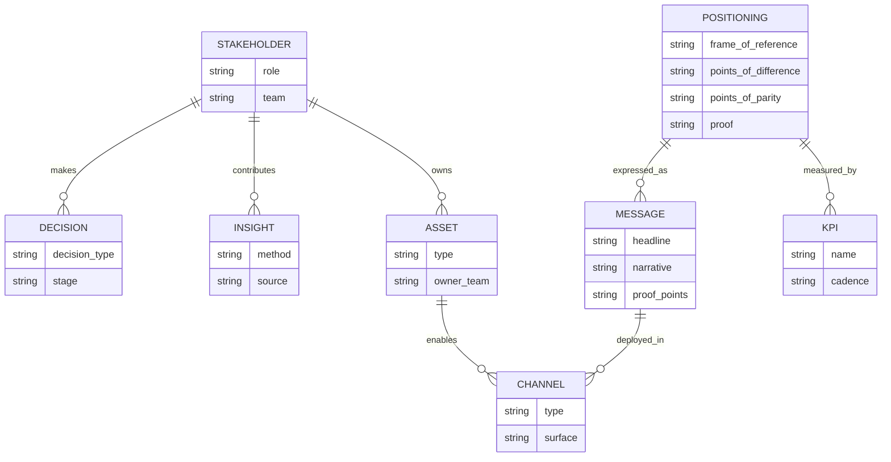

# Best Practices for Positioning Angles in Business

## Executive summary

A “positioning angle” is the **specific, chosen way** a business frames its offering so that target customers **compare it to the right alternatives** (frame of reference) and remember it for **the most motivating, credible advantage** (point of difference), while still meeting category expectations (points of parity). This report synthesizes primary/official and peer‑reviewed sources (textbook excerpts from Pearson, classic academic articles accessible via publishers, top consultancy reports, government/standards guidance, and major-brand filings/case writeups). citeturn17view0turn31view0turn50view0turn36view0turn37search0turn45view0

Several source-backed conclusions dominate best practice:

First, positioning is **not the same as a value proposition**. Kotler’s textbook treatment draws a clear boundary: the value proposition is the **full cluster of benefits and costs**, while positioning “zeroes in on the key benefits” that create advantage. Organizations that blur these concepts often produce sprawling, untestable messaging. citeturn17view0

Second, strong positioning is a **three-part strategic decision**: (1) pick a defensible frame of reference, (2) secure meaningful points of difference, and (3) ensure adequate points of parity—because points of difference alone are “not enough” to sustain a brand when consumers also expect you to “break even” on category basics. citeturn31view0turn17view0

Third, “best” angles are chosen by **explicit criteria**. Kotler’s text specifies three tests for a true point of difference—**desirability, deliverability, differentiability**—and emphasizes that a positioning statement must communicate category membership plus points of parity and difference. citeturn17view0 Consultancy research echoes the governance requirement: brand/positioning decisions must be tackled “with rigor and discipline,” grounded in data, and embedded throughout the organization rather than “owned solely” by marketing. citeturn50view0

Fourth, the most reliable development approach is **iterative research → hypothesis (angles) → testing → rollout → measurement**. Primary sources detail how to build the underpinning insight base: Voice of the Customer (VOC) methods commonly start with **10–30 one‑hour interviews**, generating **~75–150 customer-need phrases**, organized into a hierarchy and prioritized quantitatively. citeturn36view0 For testing, the most defensible standard for causal impact in digital channels is randomized controlled experimentation (A/B tests). citeturn33search3

Finally, measurable case evidence shows that repositioning can materially move business outcomes when it is anchored in insight and executed across touchpoints. Examples in this report include sales and market-share movement (e.g., Domino’s domestic same-store sales +9.9% in 2010 after an “innovative and effective advertising campaign” for recipe improvement), campaign-driven sales lifts (Old Spice body wash up 60% by May 2010 and doubling by July 2010 vs. prior year per the agency case writeup), and brand and sales results for long-running platforms (Dove’s “Real Beauty” sales trajectory and Unilever’s reporting of €6 billion for Dove in 2023). citeturn45view0turn46view0turn17view0turn38search2

## Definitions and taxonomy of positioning angles

**Positioning (core definition).** A widely taught definition in Kotler’s work frames positioning as: “the act of designing a company’s offering and image to occupy a distinctive place in the minds of the target customers.” citeturn17view0

**Value proposition vs. positioning.** In the same treatment, the value proposition is “the whole cluster of benefits the company promises to deliver,” whereas positioning focuses on the few benefits most likely to create advantage; confusing these ideas tends to produce “everything-and-the-kitchen-sink” messaging rather than an executable market stance. citeturn17view0

**Frame of reference, points of difference, points of parity.** The entity["people","Kevin Lane Keller","marketing professor"] / entity["people","Brian Sternthal","marketing professor"] / entity["people","Alice M. Tybout","marketing professor"] HBR guidance emphasizes that managers often over-focus on points of difference and underweight two other positioning requirements: (a) selecting/understanding the frame of reference and (b) ensuring parity on features customers expect, because brands sometimes must “break even” with competitors. citeturn31view0

**What a “positioning angle” means in practice (operational definition).** This report uses “positioning angle” to mean the **specific POD-within-a-FOR choice** a team commits to, such as:
- “Fastest setup and easiest use” *within* “team collaboration tools,” or
- “Premium craftsmanship” *within* “professional services firms,” or
- “Science-backed skin care” *within* “daily body wash,”  

…and that choice is what the organization translates into product priorities, proof, communications, and channel execution. This definition is an analytic synthesis of the FOR/POP/POD structure described above. citeturn31view0turn17view0turn50view0

### Types of positioning angles

A robust taxonomy can be built in two layers:

**Layer A: Frame-of-reference choice (what customers compare you to).**
- Category membership (what market you are in). citeturn17view0turn31view0  
- Competitive set / substitute set (what alternatives you want to “win against”). citeturn31view0  
- Context/occasion (the buying or usage situation you “own”). *Derived from classical positioning strategy typologies; see note below.* citeturn49search10  

**Layer B: Primary “value domain” you lead with (what benefit you emphasize).** Kotler’s textbook distinguishes value creation across functional, psychological, and monetary domains; successful positioning typically emphasizes one domain while supporting it with credible reasons to believe in the others. citeturn17view0
- Functional/performance value (quality, reliability, speed, convenience). citeturn17view0turn31view0  
- Psychological/emotional value (identity, confidence, belonging). citeturn17view0turn50view0  
- Monetary/economic value (price, total cost, efficiency). citeturn17view0turn50view0  

**Classic six-way typology (attribute, price/quality, use/application, user, product class, competitor).** Many positioning textbooks and teaching resources attribute a six-way set of approaches to Aaker & Shansby (1982). In this research run, the publisher-hosted primary source was not retrievable due to access/technical limits; therefore, the detailed list is sourced here from open educational materials that explicitly cite Aaker & Shansby, and should be treated as a secondary restatement. citeturn49search10  
If you require strict primary access to the original Business Horizons text, that access is **unspecified** in this report due to tool limitations.

### Practical “angle families” used by growth teams

The following angle families map cleanly onto the value domains and POP/POD structure above and are broadly consistent with the cited sources; where a label is a synthesis rather than a direct term used by the sources, it is clearly presented as an analytic grouping. citeturn17view0turn31view0turn50view0

| Positioning angle family | What it emphasizes | When it tends to work | Key risk | Strongest tests/KPIs |
|---|---|---|---|---|
| Performance/attribute leadership | A small set of functional advantages (“quality,” “speed,” “handling,” etc.) | When advantages are provable and durable | Easily copied; can become feature arms race | POD test (desirability/deliverability/differentiability), comprehension, perceived uniqueness citeturn17view0turn31view0 |
| Parity-first, then differentiating | Meeting “break-even” expectations, then one standout benefit | When category standards are high and buyers screen on basics | Messaging sounds generic if parity dominates | POP adequacy checks; consider/shortlist rate; especially in B2B RFPs citeturn31view0 |
| Emotional promise anchored to attributes | An emotional benefit tightly linked to product/service realities | When the category is cluttered and emotion can drive preference | “Brand can’t live on emotions alone” without attribute linkage | Emotional resonance + attribution to concrete drivers; brand tracking/consideration citeturn50view0 |
| Segment-owned (narrow beachhead) | Owning one priority segment with tailored proof | When focus beats breadth; often in early growth | TAM anxiety; internal pressure to broaden | Segment-level conversion, retention, repeat purchase frequency citeturn50view0turn45view0 |
| Transparency/trust reset | Trust, honesty, improvement, and “why believe us” | When credibility is low or reputation is damaged | If execution doesn’t match, backlash is amplified | Sentiment + customer satisfaction/retention; sales lift with lower promo dependence citeturn45view0turn50view0 |
| Price/value equation | Lower cost, better deal, or superior economics | When economics dominate choice and costs are defensible | Commoditization, margin erosion | Price premium/elasticity tests; profit-impact modeling citeturn30search7turn50view0 |

image_group{"layout":"carousel","aspect_ratio":"16:9","query":["brand positioning perceptual map example price quality matrix","points of difference points of parity diagram marketing","positioning statement template example","brand benefit ladder diagram"],"num_per_query":1}

## Selecting the right angle

The best-supported selection criteria combine “what customers will value,” “what you can credibly deliver,” and “what competitors can’t (or won’t) match,” applied inside a changing environment.

### Target audience and jobs-to-be-done style needs

VOC research guidance emphasizes capturing needs “in the customer's own words,” avoiding solution language early, and building a hierarchy from primary (strategic) to secondary and tertiary needs; this process is designed to prevent teams from prematurely locking onto internal feature assumptions. citeturn36view0

A practical implication for angle choice: a positioning angle should correspond to a **primary or high-priority secondary need**—not a tertiary implementation detail—because the target’s mental model is organized around outcomes, not internal specs. This is an inference from the VOC hierarchy rationale. citeturn36view0

### Value proposition fit and the “narrowing” discipline

Kotler’s framing implies a two-step discipline: define the whole value proposition, then select the “few” benefits your positioning will “zero in on.” citeturn17view0  
BCG makes the same strategic point more bluntly: “The brand can’t be everything to everyone,” and brand-building involves “tough tradeoffs” to reject what isn’t “on brand.” citeturn50view0

Selection checkpoint: if the angle requires messaging that would also justify major adjacent offerings (i.e., it does not constrain what you would *not* do), it is likely not a real strategic position. *This checkpoint is a synthesis of Kotler’s “zero in” and BCG’s tradeoff language.* citeturn17view0turn50view0

### Competitive landscape and the frame of reference

HBR’s positioning guidance stresses that beyond differentiation, managers must think about (a) the frame of reference and (b) features in common (parity), because consumers often expect brands to “break even.” citeturn31view0  
Kotler’s text aligns: positioning statements should communicate category membership and both points of parity and points of difference. citeturn17view0

Selection checkpoint: if your intended frame-of-reference is ambiguous, test whether buyers understand what you are *and* compare you to the alternatives you intended.

### Brand assets and identity coherence

Aaker’s widely used definition anchors identity as an aspirational managerial construct: brand identity is “a unique set of brand associations that the brand strategist aspires to create and maintain.” citeturn19view0  
BCG adds that “no brand proposition is ‘real’ until it is reflected in everything the customer experiences,” and that the brand must be embedded across the organization. citeturn50view0

Selection checkpoint: assess whether the proposed angle is consistent with (or intentionally evolves) core identity associations and whether you have (or can build) the operational and experience assets to deliver it. citeturn19view0turn50view0

### Market timing and “moving target” dynamics

BCG explicitly warns that “the brand is a moving target”: even if emotional needs stay stable, the product attributes that deliver them shift with technology and trends. citeturn50view0  
Therefore, angle selection should include a timing view: which attributes are rising in salience now, and which will likely be table stakes soon (parity), especially if competitors are already converging on them. This is an inference from BCG’s stability-of-emotion vs. change-of-attributes claim. citeturn50view0

### A source-based “angle scorecard” for decision-making

The following rubric uses Kotler’s POD criteria (desirability, deliverability, differentiability) and HBR/BCG requirements (“break even” parity; embed in experience). citeturn17view0turn31view0turn50view0

| Criterion | What to ask | Evidence you should require |
|---|---|---|
| Desirability | Do target buyers care enough that it changes choice? citeturn17view0 | VOC priorities; willingness-to-switch; concept preference lifts citeturn36view0 |
| Deliverability | Can we deliver consistently across touchpoints? citeturn17view0turn50view0 | Operational proof, experience audits, reliability metrics, support capacity (unspecified if no internal data) |
| Differentiability | Is it meaningfully distinct in this frame of reference? citeturn17view0turn31view0 | Competitive mapping; buyer perception of uniqueness; “why us not them” tests |
| POP adequacy | Are we at least at parity on expected features? citeturn31view0turn17view0 | “Break-even” check questions; procurement/RFP must-haves (unspecified) |
| Organizational embed-ability | Can the org execute it; is marketing not the sole owner? citeturn50view0 | Governance plan; cross-functional sign-off; internal enablement readiness |

## Developing and testing positioning angles

This section gives a step-by-step, test-driven process, with explicit research methods and metrics/KPIs grounded in the cited sources.

### Process overview

```mermaid
flowchart TD
  A[Define scope: market, offering, decision context] --> B[Insight foundation: VOC + competitive landscaping + internal data]
  B --> C[Choose frame of reference candidate(s)]
  C --> D[Draft multiple positioning angles: POD + POP + RTB]
  D --> E[Qualitative screening: comprehension & resonance]
  E --> F[Quant testing: concept/copy tests + preference diagnostics]
  F --> G[Experimentation: A/B tests in real channels where feasible]
  G --> H[Decision & documentation: positioning statement + narrative]
  H --> I[Rollout: product/experience alignment + comms + enablement]
  I --> J[Measurement system: brand scorecard + commercial KPIs]
  J --> D
```

Key methodological grounding for this loop:
- BCG recommends synthesizing qualitative interviews, quantitative research, internal financial information, and competitive landscaping “in a systematic process,” and continuing through implementation and performance measurement. citeturn50view0  
- VOC guidance explains how to generate and structure customer needs and why teams must avoid jumping too early into solutions. citeturn36view0  
- Controlled online experiments (A/B tests) are presented as a practical way to evaluate ideas quickly via randomized experiments. citeturn33search3  
- Kotler stresses creating a positioning statement that communicates category membership plus POP/POD and aligns the organization’s market actions. citeturn17view0

### Research methods by phase

**Customer insight foundation (VOC / qualitative discovery).** The VOC material defines the process as capturing requirements to produce detailed needs, organizing them hierarchically, and prioritizing them by importance and satisfaction; it also states VOC typically combines qualitative and quantitative steps, often at the “fuzzy front end” of initiatives. citeturn36view0  
Concrete practice details include:
- Early qualitative needs identification is “primarily a qualitative research task,” and “in a typical study between 10 and 30 customers are interviewed for approximately one-hour in a one-on-one setting.” citeturn36view0  
- Interviews should be experiential and can include contextual inquiry/ethnography, including on-site observation. citeturn36view0  
- Teams often identify 75–150 need phrases and must keep them in customers’ words to avoid losing meaning. citeturn36view0  

**Angle drafting and internal alignment.** Kotler’s treatment implies that once a positioning strategy is designed, marketers create a positioning statement to communicate the positioning internally and ensure it guides actions. citeturn17view0  
For product and innovation contexts, Moore’s “elevator test” (positioning statement elements) is frequently taught as a structured internal articulation:
- “For (target customer) … Who (statement of the need or opportunity) … The (product name) is a (product category) … That (key benefit/compelling reason to buy) … Unlike (primary competitive alternative) … Our product (primary differentiation).” citeturn12view0

**Quantitative testing and copy testing.** The FTC-hosted academic paper defines advertising copy testing as a quantitative and qualitative research method used to pretest ads where numerical data on effects is collected. citeturn37search0  
For surveys and instruments, ESOMAR provides professional guidance resources on questionnaire design (availability of full details may depend on access). citeturn37search3  
When using online samples/panels, ESOMAR/GRBN’s guideline sets out methods for ensuring sample quality across providers, buyers, and end clients. citeturn37search21

**In-market experimentation.** Controlled web experiments (A/B tests) are described as randomized experiments that enable rapid evaluation of ideas on live users, supporting causal inference in digital environments. citeturn33search3

### Metrics and KPIs for positioning angle testing

A useful KPI stack spans: (1) *message/meaning metrics*, (2) *brand-choice metrics*, and (3) *business outcome metrics*.

BCG explicitly ties brand work to outcomes (loyalty, sales, profit, shareholder returns) and stresses it must be measured and tracked over time, supported by quantitative research and economics-based thinking. citeturn50view0  
Bain frames brand impact as shifting demand via price premium, volume, or both. citeturn30search7

| Layer | KPI examples | How to measure (recommended) | Source basis |
|---|---|---|---|
| Message understanding | Comprehension, recall of key benefit, perceived clarity | Qual screening + survey concept tests (questionnaire rigor important) | Copy testing definition & survey guidance citeturn37search0turn37search3 |
| Distinctiveness | Perceived uniqueness vs main alternative; “why choose us” | POP/POD questions; competitive set A/B message tests | POP/POD necessity citeturn31view0turn17view0 |
| Credibility | Believability / deliverability perception | Proof tests, claim substantiation checks; experienced-based validation | POD “deliverability” criterion citeturn17view0 |
| Preference/choice | Consideration, intent, share-of-preference | Conjoint / choice tests (unspecified here); channel experiments where feasible | Need for quant + economic analysis citeturn50view0turn33search3 |
| Conversion | CTR, CVR, funnel progression | Randomized A/B tests; holdouts | Controlled experiments citeturn33search3 |
| Commercial outcomes | Price premium, volume lift, repeat purchase frequency | Sales/market share data; cohort retention; brand tracking scorecards | Bain “shift demand”; BCG tracking citeturn30search7turn50view0 |

## Frameworks compared

This section compares the dominant positioning-related frameworks you requested (as available via reputable/official sources in this research run) and closely related models that are heavily used in practice.

| Framework | Core question it answers | Key constructs | Strengths | Known limitations / cautions |
|---|---|---|---|---|
| Ries & Trout (positioning as “winning the mind”) | “What do we want to stand for in the customer’s mind?” | Mind-share, category creation, focus (as practiced by their firm) | Enforces focus and competitive contrast; emphasizes memorable mental availability | Primary textbook quotes not included here because official preview access was **unspecified**; firm site is practitioner-oriented citeturn51view0 |
| Kotler (Marketing Management) | “How do we craft value proposition + positioning systematically?” | Positioning definition; value proposition; POP/POD; POD criteria | Clear operational definitions; explicit tests for POD (desirable, deliverable, differentiable) | Textbook excerpt is partial; some deeper toolkits may be outside the sample citeturn17view0 |
| Keller/Sternthal/Tybout (HBR) | “What are we missing if we only talk differentiation?” | Frame of reference; points of parity; points of difference | Forces “break-even” thinking and category expectations | Full “three questions” tool details not available in the freely visible portion here citeturn31view0 |
| Moore (technology GTM positioning statement) | “Can we articulate a crisp why-buy for a target segment?” | Structured positioning statement (“For…who…the…is a…that…Unlike…our…”) | Excellent for internal clarity, especially B2B/tech; naturally ties to competitive alternative | Template is an articulation tool; still requires separate customer proof and testing citeturn12view0 |
| Aaker (brand identity) | “What associations should our brand aspire to create and maintain?” | Brand identity as a set of associations | Strong bridge between long-term identity and positioning coherence | Identity alone doesn’t ensure market differentiation; must connect to FOR/POP/POD and evidence citeturn19view0turn31view0 |
| BCG brand-centric transformation | “How do we run brand/positioning like a transformation with measurement?” | Brand benefit ladder; insight synthesis; internal embed; scorecard | Explicit on rigor, organizational embed, and continuous adaptation; includes governance mechanisms | Consultancy model: requires substantial data, executive attention, and program management to execute well citeturn50view0 |

### A practical synthesis

A high-rigor practice stack that is consistent with the above sources looks like this:

1) Use Kotler and HBR to force **FOR + POP + POD discipline**, and to screen candidate PODs via desirability/deliverability/differentiability. citeturn17view0turn31view0  
2) Use VOC methods to ensure the POD is grounded in customer language and priorities—not internal assumptions. citeturn36view0  
3) Use Moore’s structured statement to ensure internal crispness and “competitive alternative” specificity. citeturn12view0  
4) Use BCG’s transformation logic to ensure the positioning becomes real in experience and gets measured and governed like other strategic initiatives. citeturn50view0  
5) Use experimentation, where possible, to causally validate message and offer changes in market. citeturn33search3

## Common pitfalls and how to avoid them

This section focuses on failure modes that are directly supported by the sources (and marks anything else as **unspecified**).

### Confusing differentiation with positioning completeness

**Pitfall.** Over-indexing on points of difference while neglecting frame-of-reference clarity and points of parity. HBR explicitly warns that points of differentiation “alone are not enough” and brands must sometimes “break even” on features in common with competitors. citeturn31view0

**Avoidance.** For every candidate angle, document:
- Frame of reference (category/competitive set),
- POP list (what you must match),
- POD list (what you must lead). citeturn31view0turn17view0

### Trying to serve “everyone” with one angle

**Pitfall.** Broad, inclusive positioning that avoids tradeoffs. BCG: “The brand can’t be everything to everyone,” and managers must reject opportunities that aren’t “on brand.” citeturn50view0

**Avoidance.** Require an explicit “We are not for…” clause in the internal positioning documentation (template provided later; wording is **unspecified** but the tradeoff principle is supported). citeturn50view0

### Emotional storytelling without operational truth

**Pitfall.** BCG cautions that “The brand can’t live on emotions alone” and emotional connection must be linked to product/service attributes and customer experience. citeturn50view0

**Avoidance.** Treat emotional claims as hypotheses that require:
- Attribute linkage (what exactly makes the emotion true),
- Touchpoint delivery plan (where it will be felt),
- Proof (data, demos, guarantees, service standards). citeturn50view0

### Letting the “HiPPO” decide the angle

**Pitfall.** Choosing positioning by senior opinion rather than evidence. Controlled experiment guidance highlights that teams learn when they “listen to their customers, not to the Highest Paid Person’s Opinion (HiPPO).” citeturn33search3

**Avoidance.** Make one in-market randomized test a default requirement for final selection when a digital channel exists (exact governance threshold is **unspecified**, but the causal-testing rationale is supported). citeturn33search3

### Poor research hygiene in testing

**Pitfall.** Low-quality samples, leading questions, or invalid measurement can “validate” the wrong angle. ESOMAR/GRBN provides explicit guidance to ensure online sample quality across stakeholders, and ESOMAR also emphasizes questionnaire design as a professional discipline. citeturn37search21turn37search3

**Avoidance.** Adopt a quality checklist for:
- Sample provenance and controls (panel/source transparency),
- Fraud/duplication checks,
- Questionnaire design review and cognitive pretesting (specific steps **unspecified** if not available in your ESOMAR access tier). citeturn37search21turn37search3

### Treating positioning as a marketing-only artifact

**Pitfall.** BCG states the brand is “not a separate entity” that can be owned solely by marketing; it must be embedded in the line business and sold across the organization for execution. citeturn50view0

**Avoidance.** Create a cross-functional decision forum and require sign-off from functions that own the experience (product/operations/service/sales). The governance model is detailed in the last section. citeturn50view0

## Case studies and examples

The cases below are limited to major-brand and reputable primary/official sources available in this research run (SEC filings, official company news, top-consultancy case vignettes, and agency case writeups).

### Case study summary table

| Brand / organization | “Before” positioning (simplified) | “After” positioning angle | What changed | Measurable outcome(s) |
|---|---|---|---|---|
| entity["company","Domino’s Pizza, Inc.","quick-service restaurant"] | Product and promotional underperformance in prior years (quality perception issues; management described “underperformance” in 2007–2008) citeturn43view0 | “Improved pizza recipe” + “innovative, transparent and effective” advertising campaign citeturn45view0 | Recipe improvement (late 2009) + campaign + ops + technology and promotions citeturn45view0 | Domestic same store sales: +9.9% in 2010; the filing attributes the increase to the campaign and related initiatives citeturn45view0 |
| entity["company","Old Spice","men’s personal care brand"] | Category growth with many entrants; needed renewed relevance; campaign insight: 60% of purchases made by women citeturn46view0 | Couple-conversation, humorous masculinity: “The Man Your Man Could Smell Like” citeturn46view0 | Targeting “where couples would be watching together” + rapid interactive response content citeturn46view0 | By May 2010, sales of Red Zone Body Wash +60% YoY; by July 2010, sales doubled citeturn46view0 |
| entity["company","Dove","personal care brand"] (entity["company","Unilever","consumer goods company"]) | Historical advertising emphasized functional ingredient/attribute benefits (e.g., moisturizing cream) citeturn17view0 | “Real Beauty” platform: emotional/social positioning around inclusive beauty standards citeturn17view0turn38search2 | Shift in communications, models, PR/films, and initiatives like self-esteem funding citeturn17view0turn38search2 | Kotler text reports sales grew from $2.5B to $6B over ~15 years; Unilever reports Dove delivered €6B for Unilever in 2023 citeturn17view0turn38search2 |
| entity["hotel","Hilton Hotels & Resorts","global hotel brand"] | Threatened by focused-service segment; legacy heritage risked becoming a roadblock citeturn50view0 | New global brand positioning built from large research program and brand promise redesign citeturn50view0 | “Biggest global-research program” + program management office + ~25 initiatives across touchpoints + internal culture systems citeturn50view0 | Reported improvement in brand consideration (~5 percentage points) and market share increase (exact figure truncated in excerpt) citeturn50view0 |
| entity["company","Intel","semiconductor company"] | Needed specialized microprocessors for applications; used VOC to identify unmet needs citeturn36view0 | Product positioning informed by unmet needs; “v-Pro™” emerged from VOC citeturn36view0 | Ethnography + interviews + affinitization + large-scale prioritization surveys citeturn36view0 | v‑Pro became fastest product in Intel’s history to exceed $1B in revenue citeturn36view0 |
| entity["company","PPG","industrial coatings company"] | Sought opportunities in industrial coatings; VOC training across divisions citeturn36view0 | New product positioning based on unmet needs from VOC citeturn36view0 | VOC process and team training; product development from needs citeturn36view0 | Report describes acquisition of major share in a rapidly expanding industry (precise percentage **unspecified** in accessible excerpt) citeturn36view0 |

### Why these cases matter for “positioning angles”

The cases illustrate several repeatable mechanisms:

- **Angle clarity tied to execution**: Domino’s links improved product + transparent campaign + operational excellence and shows associated same store sales lift. citeturn45view0  
- **Non-obvious target insight that reshapes the creative angle**: Old Spice leveraged the insight about who buys, not just who uses, and measured substantial short-term sales lift. citeturn46view0  
- **Emotional/social positioning backed by programs and content**: Dove moved from a functional attribute message to an identity/social platform that the company reports as commercially meaningful. citeturn17view0turn38search2  
- **Governance and program management**: Hilton shows that repositioning at scale is run like a transformation with a PMO and cross-touchpoint initiatives. citeturn50view0  
- **VOC as a positioning engine**: Intel and PPG show that positioning can emerge from systematic need discovery, not only from creative reframing. citeturn36view0  

## Practical templates, governance, timelines, and budgets

This final section provides tools you can directly apply, grounded where possible in the cited sources; anything not explicitly supported is marked **unspecified** as requested.

### Positioning statement templates

**Moore “elevator test” template (verbatim structure).** The following elements are presented as Moore’s formulation and are widely used to articulate positioning succinctly:  
“For (target customer) … Who (statement of the need or opportunity) … The (product name) is a (product category) … That (key benefit / compelling reason to buy) … Unlike (primary competitive alternative) … Our product (primary differentiation).” citeturn12view0

**Kotler-aligned positioning statement components (supported conceptually).** Kotler’s text states that an effective positioning statement should communicate category membership and POP/POD and that it is used to guide market actions. A specific fill‑in‑the‑blank wording is **unspecified** in the excerpt, so the template below is a practical derivation, not a direct quote: citeturn17view0  
Template (derivation; wording **unspecified**):  
- For: [target customers]  
- In: [frame of reference/category]  
- Our brand: [name]  
- Delivers: [primary point of difference]  
- Because: [reasons to believe / proof]  
- And we meet: [points of parity / category expectations]

**POD qualification checklist (directly supported).** Kotler’s text provides three criteria that determine whether a brand association can function as a point of difference: desirability, deliverability, and differentiability. citeturn17view0  
Use it as a forced scoring rubric before you spend heavily on an angle.

### Testing scripts and survey questions

**VOC interview guide skeleton (partly sourced, partly unspecified).** VOC guidance says teams must design the discussion guide, conduct/observe interviews, and extract needs statements; it recommends experiential interviews and notes customers often cannot articulate needs when asked directly. citeturn36view0  
A practical script consistent with that guidance (specific wording **unspecified**):
- “Walk me through the last time you [did the job]. What triggered it? What did you do first?”  
- “What was frustrating or risky? What would ‘perfect’ look like?”  
- “What alternatives did you consider and why?”  
- “What would make you switch?”  
- “If you could wave a magic wand, what would the solution do for you?”  

**Concept/message test survey module (recommended structure; item wording partly unspecified).** Copy testing is defined as pretesting ads with quantitative and qualitative methods and numerical data on effects. citeturn37search0  
A measurement module that aligns with POP/POD and POD-criteria thinking (question wording **unspecified**, constructs supported):
- Frame-of-reference clarity: “This offering is best described as a ___.” (multiple choice) citeturn31view0turn17view0  
- POP adequacy: “It meets my minimum expectations for ___.” (Likert) citeturn31view0  
- Desirability: “This matters to me when choosing ___.” (Likert) citeturn17view0turn36view0  
- Deliverability/credibility: “I believe this company can deliver ___ consistently.” (Likert) citeturn17view0turn50view0  
- Differentiability: “Compared with my main alternative, this is meaningfully different on ___.” (Likert + forced comparison) citeturn17view0turn31view0  
- Choice proxy: forced-choice “Which would you choose?” with alternatives and prices (exact design **unspecified**).  

**Online sample quality checklist (supported concept).** Use ESOMAR/GRBN’s online sample quality guideline to define responsibilities and quality criteria for online samples; detailed operational items depend on your implementation. citeturn37search21

### A/B test designs for positioning angles

Controlled experiments on the web are described as randomized experiments (A/B tests and generalizations) that evaluate ideas quickly. citeturn33search3  
Three practical A/B designs (specific parameters **unspecified**, causal logic supported):

1) **Message-only test (copy framing)**  
- Control: current headline/value claim  
- Treatment: positioning-angle claim + proof snippet  
- Primary KPI: conversion rate to qualified lead / purchase; secondary: bounce rate, scroll depth  
- Use when: you can change messaging without changing the product

2) **Proof test (reason-to-believe)**  
- Control: angle claim alone  
- Treatment: angle claim + quantified proof or guarantee  
- KPI: conversion rate and downstream retention (if measurable)

3) **Frame-of-reference test (category anchoring)**  
- Control: category label A (e.g., “project management”)  
- Treatment: category label B (e.g., “work OS”)  
- KPI: mix of qualified traffic and conversion; monitor mismatch risk (support tickets, churn)  
- Use when: category choice is strategic and ambiguous citeturn31view0

### Recommended organizational roles and governance

BCG makes two governance points explicit:
- brand decisions must be debated by senior management, grounded in data, and embedded through the organization, citeturn50view0  
- and the brand cannot be owned solely by marketing and agency partners; it must be embedded in the line business and sold across sales/operations/franchisees with internal brand-building. citeturn50view0  

VOC guidance likewise stresses the core team must “own and be highly involved” in designing and analyzing VOC; only then can they internalize customer needs and make effective decisions. citeturn36view0

A governance model consistent with these sources (role names partly **unspecified**, decision-right logic supported):

- **Executive sponsor (CEO/GM or BU head)**: final decision on FOR + POD tradeoffs; ensures cross-functional compliance. citeturn50view0  
- **Positioning owner (often product marketing / brand strategy lead)**: runs the process, drafts angles, consolidates evidence; steward of positioning statement. citeturn17view0turn50view0  
- **Research lead**: owns VOC program, sample design, instrument quality, and interpretation; ensures research rigor. citeturn36view0turn37search21turn37search3  
- **Product/operations owners**: validate deliverability; convert positioning into experience standards. citeturn50view0turn17view0  
- **Sales/customer success**: validate parity requirements and objection handling; field feedback loop (specific mechanisms **unspecified**). citeturn50view0  
- **Finance**: evaluates profit impacts and tradeoffs (BCG calls for economics-based thinking). citeturn50view0turn30search7  



### Timelines and budgets

**Timelines.** Sources here provide concrete inputs for portions of the work (e.g., VOC interview counts and typical durations), but do not prescribe an end-to-end project timeline. Therefore:
- VOC qualitative discovery often implies **10–30 hours of interviewing** (10–30 interviews × ~1 hour each) plus analysis and hierarchy building (analysis time **unspecified** in the source). citeturn36view0  
- Any full timeline for positioning development (e.g., total weeks from discovery to rollout) is **unspecified** in the cited sources and varies by organization size, research depth, buying-cycle complexity, and whether product changes are required.

**Budgets.** None of the accessible primary sources in this run specify standard dollar budgets for positioning projects. Therefore, any numeric budget range is **unspecified**. What the sources do support is the principle that brand/positioning investment must be treated with rigor and quantified tradeoffs, implying that budget should be justified by expected impact and measured over time. citeturn50view0turn30search7

### Direct source links

The citations throughout this report link to sources. For convenience, here are direct URLs (as requested):

```text
Pearson (Marketing Management excerpt, positioning/value proposition/POP-POD): https://www.pearson.de/media/muster/ext/9781292405100.pdf
HBR (Keller/Sternthal/Tybout on POP/POD & frame of reference): https://hbr.org/2002/09/three-questions-you-need-to-ask-about-your-brand
Pearson sample pages (Moore positioning statement elements, reprinted with permission): https://ptgmedia.pearsoncmg.com/images/9780133489460/samplepages/0133489469.pdf
VOC guide (MIT Sloan / Applied Marketing Science; method & sample sizes): https://mitsloan.mit.edu/shared/ods/documents?PublicationDocumentID=3964
Aaker identity definition (Journal of Business Research, ScienceDirect abstract page): https://www.sciencedirect.com/science/article/abs/pii/S014829631630532X
BCG Brand-Centric Transformation report (method + Hilton vignette): https://web-assets.bcg.com/img-src/BCG_Brand_Centric_Transformation_Jul_11_tcm9-63146.pdf
SEC filing (Domino’s 10-K with 2010 same-store sales and campaign attribution): https://www.sec.gov/Archives/edgar/data/1286681/000119312512083193/d256751d10k.htm
Wieden+Kennedy case writeup (Old Spice outcomes): https://www.wk.com/work/old-spice-smell-like-a-man-man/
Unilever newsroom (Dove €6B in 2023): https://www.unilever.com/news/news-search/2024/20-years-on-dove-and-the-future-of-real-beauty/
FTC-hosted paper on copy testing methods: https://www.ftc.gov/system/files/attachments/putting-disclosures-test-materials/pechmann_and_andrews_2010_copy_test_methods.pdf
Springer paper (controlled web experiments / A-B tests): https://ai.stanford.edu/~ronnyk/2009controlledExperimentsOnTheWebSurvey.pdf
ESOMAR/GRBN online sample quality guideline (PDF): https://www.researchgate.net/profile/Nirmala-Svsg/post/Does-anyone-have-information-regarding-the-quality-of-data-collected-from-participants-recruited-on-line-through-social-media/attachment/59d63cd179197b8077999bd6/AS%3A417085181186051%401476452264621/download/ESOMAR-GRBN_Online-Sample-Quality-Guideline_February-2015.pdf
```

